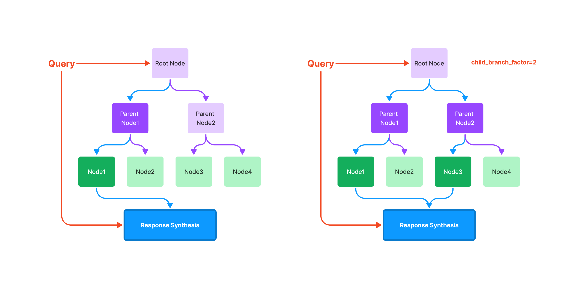
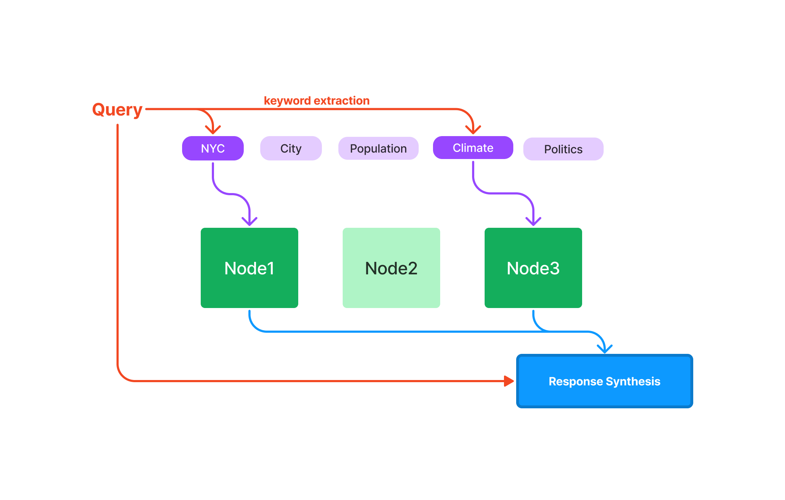

# Llama Index

LlamaIndex is a data framework specifically designed for language model (LLM) applications, focusing on ingesting, structuring, and accessing private or domain-specific data. It offers tools for integrating private data into LLMs, structures ingested data for LLM consumption, and provides engines for natural language access

LlamaIndex takes a different approach called Retrieval-Augmented Generation (RAG). Instead of asking LLM to generate an answer immediately, LlamaIndex:

- retrieves information from your data sources first,
- adds it to your question as context, and
- asks the LLM to answer based on the enriched prompt.

RAG overcomes all three weaknesses of the fine-tuning approach:

- There’s no training involved, so it’s cheap.
- Data is fetched only when you ask for them, so it’s always up to date.
- LlamaIndex can show you the retrieved documents, so it’s more trustworthy.

LlamaIndex offers four main functions: 

- Data connectors to ingest data from various sources; 
- Data indexes to structure data for LLM consumption; 
- Engines for natural language access, including query engines, chat engines, and data agents; 
- Application integrations to tie LlamaIndex into your broader ecosystem like LangChain or Flask

## Install and set up 

```
pip install llama-index
```

### OpenAI Environment Setup


Based on the LM studio method, we hosted our models on the DL2 machine. Thanks to that method, the models are accessible by the Open AI API libraries. 

```
from langchain.llms import OpenAI

from sentence_transformers import SentenceTransformer #required sentence_transformers to be installed
from langchain.embeddings import SentenceTransformerEmbeddings

from llama_index import ServiceContext
```
Initialize LLM and embeddings model 

```
# Initialize the SentenceTransformerEmbeddings with the loaded model
local_embeddings = SentenceTransformerEmbeddings(model_name="your_emb_model")

llm = OpenAI(openai_api_key="NULL",temperature=0,openai_api_base="LM_studio_adress")
service_context = ServiceContext.from_defaults(llm=llm, embed_model=local_embeddings)
```


## Loading stage

LlamaIndex efficiently loads various data types into documents using connectors, which ingest data from their native sources and formats. Find the different connectors on [LlamaHub](https://llamahub.ai/?tab=loaders).

```
PDFReader = download_loader("PDFReader")  
loader = PDFReader()
```

## Indexing Stage

***Documents***: In LlamaIndex, documents are the primary data units and consist of the text you want to analyze or retrieve information from.

***Nodes***: Nodes are chunks of text from a document. LlamaIndex parses documents into nodes, creating a structured representation. 

Nodes in LlamaIndex are used as building blocks for various indexing methods, like summary, vector store, tree, and keyword table indexes. They allow for efficient querying and retrieval by organizing and structuring data for easy access and analysis. Each indexing method utilizes nodes differently to optimize for specific retrieval tasks​

### Summary Index 


The summary index does offer numerous ways of querying a summary index, from an embedding-based query which will fetch the top-k neighbors, or with the addition of a keyword filter

### Vector store index


Querying a vector store index involves fetching the top-k most similar Nodes, and passing those into our Response Synthesis module.

### Tree Index
The tree index builds a hierarchical tree from a set of Nodes (which become leaf nodes in this tree).



Querying a tree index involves traversing from root nodes down to leaf nodes. By default, (child_branch_factor=1), a query chooses one child node given a parent node. If child_branch_factor=2, a query chooses two child nodes per level.

### keyword Table index
The keyword table index extracts keywords from each Node and builds a mapping from each keyword to the corresponding Nodes of that keyword.


During query time, we extract relevant keywords from the query, and match those with pre-extracted Node keywords to fetch the corresponding Nodes. The extracted Nodes are passed to our Response Synthesis module.


## Querying Stage
[**Retrievers**](https://docs.llamaindex.ai/en/stable/module_guides/querying/retriever/root.html): A retriever defines how to efficiently retrieve relevant context from an index when given a query. Your retrieval strategy is key to the relevancy of the data retrieved and the efficiency with which it’s done.

[**Routers**](https://docs.llamaindex.ai/en/stable/module_guides/querying/router/root.html): A router determines which retriever will be used to retrieve relevant context from the knowledge base. More specifically, the RouterRetriever class, is responsible for selecting one or multiple candidate retrievers to execute a query. They use a selector to choose the best option based on each candidate’s metadata and the query.

[**Node Postprocessors**](https://docs.llamaindex.ai/en/stable/module_guides/querying/node_postprocessors/root.html): A node postprocessor takes in a set of retrieved nodes and applies transformations, filtering, or re-ranking logic to them.

[**Response Synthesizers**](https://docs.llamaindex.ai/en/stable/module_guides/querying/response_synthesizers/root.html): A response synthesizer generates a response from an LLM, using a user query and a given set of retrieved text chunks.

## integration


# Bibliography 

- [Llama Index VS Langchain](https://www.gettingstarted.ai/langchain-vs-llamaindex-difference-and-which-one-to-choose/)
- [Llama Index Documentation](https://docs.llamaindex.ai/en/stable/)
- [LlamaIndex: How to Use Index Correctly](5https://betterprogramming.pub/llamaindex-how-to-use-index-correctly-6f928b8944c6)
