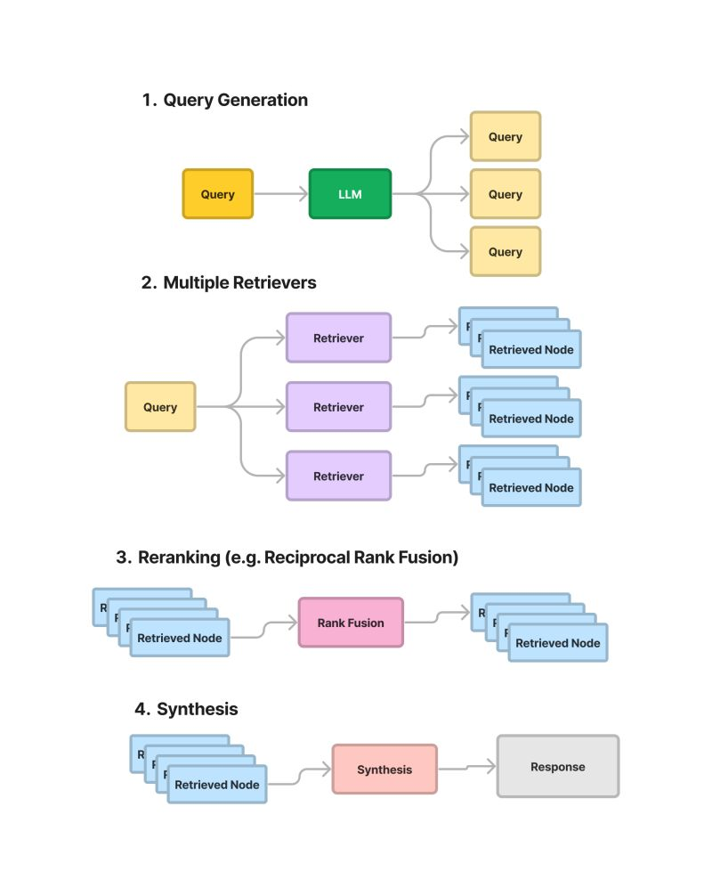

# RAG Fusion - Advanced Information Retrieval Technique

RAG Fusion, short for Retrieval-Augmented Generation Fusion, is an innovative approach that enhances information retrieval by combining the strengths of diverse retrieval methods. This technique involves generating multiple refined queries from an initial user query, leveraging the power of Large Language Models (LLMs) for query rewriting and precision enhancement.

Each refined query is then processed through an ensemble of retrievers, such as vector-based and BM25 retrievers, to fetch the most relevant results.
 
The core of RAG Fusion lies in its unique fusion process, where results from all retrievers are combined and re-ranked using reciprocal rank fusion, ensuring a comprehensive and highly relevant set of results. Ideal for complex information retrieval tasks, RAG Fusion stands out in its ability to synthesize information from varied sources, offering a robust solution for advanced search and data retrieval applications.

