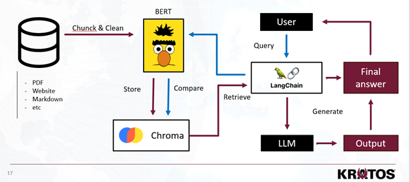
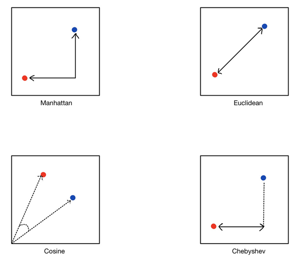
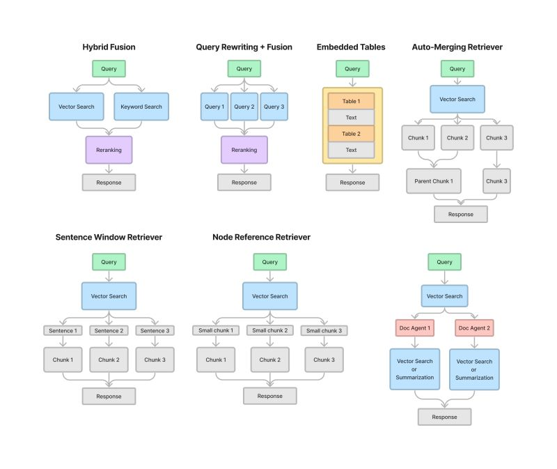

# Virtual Assistant presentation

The virtual assistant project, rooted in the LangChain framework, epitomizes the fusion of advanced NLP and transformer models to create a user-friendly virtual assistant. Utilizing LangChain, we constructed a streamlined pipeline connecting a chroma vector store and a large language model, Mistral 7b. This pipeline is central to our project, enabling text transformation into embeddings and facilitating natural language generation for user interactions.  The LangChain framework played a pivotal role in simplifying AI integration, offering seamless connections between different pipeline segments. This not only resulted in straightforward coding but also opened avenues for customization and future enhancements

One of the foremost challenges we tackled was optimizing the application for local hardware, striking a balance between speed, performance, and output relevance. A key hurdle was the efficient loading of the large language model, Mistral, on a standard NVIDIA RTX 4090 GPU. Our solution involved using libraries like accelerate and bitsandbytes for effective quantization, significantly reducing the model size while maintaining performance. Additionally, we confronted the complexity of constructing a bespoke virtual environment, an endeavor that necessitated a foundation in best practices and insights from similar projects. The application of embeddings was twofold: creating a vector-based knowledge database and converting user queries into embeddings. We employed sentence transformers from the BERT architecture for these tasks. These embeddings allow us to perform cosine similarity searches to retrieve relevant data and subsequently improve the prompts given to the language model. The integration of these elements resulted in a virtual assistant capable of generating contextually relevant responses. For data management, we chose Chroma DB, an open-source vector store tool. This facilitated the organization of embeddings into collections corresponding to different document types, each tagged with metadata for easy retrieval. 

The app development, still in its nascent stages, boasts a straightforward user interface inspired by platforms like ChatGPT. Our aim was to streamline user interaction, focusing on a chatbot-like interface for easy access to information.  The efficiency of our virtual assistant hinged on advanced model loading techniques, particularly quantization, to minimize GPU VRAM usage. Caching functions within the application ensured that the model was loaded just once per session, enhancing overall performance. 
For testing and validation, we conducted functional tests to assess stability, response accuracy, and context-awareness. Future includes a more extensive testing phase, incorporating user feedback and ratings to refine the application further.  Our project stands as a testament to the potential of existing AI technologies in non-specialized environments, demonstrating that powerful tools like large language models can be adapted effectively in various settings, including corporate ones.

### BERT (Bidirectional Encoder Representations from Transformers)
 Bert is crafted to comprehend word context in sentences by analyzing them bidirectionally. This ensures the genuine essence of the words is grasped. Sentence Transformers take this a step further by enabling entire sentences or paragraphs to be represented as embeddings. This ensures the retention of both individual word meanings and their broader context within a sentence or paragraph.

- **Cross-Encoder**: This model takes a pair of sentences and feeds them simultaneously into a single BERT model. The combined input allows the model to attend to both sentences at the same time, capturing the interaction between them. The output is then passed to a classifier that gives a score between 0 and 1, reflecting the relevance or similarity of the sentence pair. Cross-Encoders generally achieve better performance because of the interaction between the sentence pairs, but they are computationally more expensive since you cannot pre-compute embeddings for each sentence separately.

**Retrieval with Bi-Encoder**: You start with a query and use a Bi-Encoder to retrieve a subset of potentially relevant documents from a large corpus. This step is fast because you're comparing the query embedding to a set of pre-computed embeddings.

**Re-ranking with Cross-Encoder**: Once you have the subset of retrieved documents, you can use a Cross-Encoder to re-rank this subset. This step involves pairwise comparisons between the query and each retrieved document, allowing the model to deeply analyze the relevance of each document to the query.

### LangChain
is an innovative framework developed for the creation of applications driven by language models. It allows seamless connection to data sources and enables interactive engagements with different environments. Fundamentally, LangChain employs "chains", combining a "prompt template" (which guides the language model) and an "output parser" (which structures the model's response). This design ensures easy integration of language models into a variety of applications, making them data-aware and interactive.
Our system architecture deploys LangChain as a mediator connecting the user, the vector store, and the LLM. After converting data into embeddings and extracting relevant information in response to a query, we employ an LLM to polish and convert the raw data—identified based on vector similarity into clear and accurate answers for the user.

- LangChain offers a unique ability to customize prompts. Developers have the option to set a character limit, such as 500 characters, for virtual assistant responses. Beyond this, LangChain's templates provide even more specificity, enabling targeted responses to user inquiries. For instance, if a user poses a question, the system can be set up to focus on explaining just a single word from that inquiry using LangChain's capabilities.

- LangChain goes beyond basic functionalities to offer intricate customization options. Developers can establish unique chain architectures tailored to specific needs. One capability includes designating a particular similarity algorithm for the system when combing through the vector store. Upon data retrieval, LangChain enables the precise feeding of this raw data into language models like the LLM. Additionally, constraints can be set on the LLM's final output, ensuring responses are not only pertinent but also compliant with set guidelines.

In essence, LangChain streamlines the communication process between the user, the vector store, and the LLM. It ensures that the user's needs are not only met but are addressed in a way that's precise, customizable, and intuitive.

#### Langchain usefull links
[Langchain tutorials](https://github.com/gkamradt/langchain-tutorials) (Open AI api needed) 

[Documentation](https://python.langchain.com/docs/get_started/introduction.html)
- [Langchain_OpenAi](https://python.langchain.com/docs/integrations/text_embedding/openai)
- [Langchain_Chroma](https://python.langchain.com/docs/integrations/vectorstores/chroma)

-[Lagnchain project](https://becomingahacker.org/langchain-is-everywhere-5415613390f1)

[Github](https://github.com/langchain-ai/langchain/tree/master) for All docs

## Chat bot prototype

- [Retriever](http://192.168.48.32:8058)
- [Virtual Asisstant](http://192.168.48.33:8501/)
- [Cross Encoder](http://192.168.48.32:8502/)

# Deeper understanding

## Distance Metrics

- **Manhattan Distance**: Also known as taxicab or city block distance. It measures the distance between two points in a grid based plane by only moving horizontally and vertically, like navigating the blocks in a city. The path resembles an 'L' shape.

- **Euclidean Distance**: The most common distance metric, it is the straight-line distance between two points in Euclidean space. This is derived from the Pythagorean theorem and is the shortest path between two points.

- **Cosine Similarity**: Unlike the other three, cosine similarity measures the cosine of the angle between two vectors in a multi-dimensional space. It is often used to measure similarity rather than distance, with a value ranging from -1 (very different) to 1 (very similar). The dotted lines suggest the projection of one vector onto another, which is related to how cosine similarity is calculated.

- **Chebyshev Distance**: This metric measures the greatest of the differences along any coordinate dimension between two vectors. It is sometimes called chessboard distance, as it represents the minimum number of moves a king would make on a chessboard to go from one square to another.

## RAG (next step)

# Further reading

### Memory 

 - [Conversational buffer](https://python.langchain.com/docs/modules/memory/types/buffer)

## HuggingFace usefull links

- [PreTrainedModel](https://huggingface.co/docs/transformers/v4.34.0/en/main_classes/model#transformers.PreTrainedModel)
- [Generation config](https://huggingface.co/docs/transformers/v4.34.0/en/main_classes/text_generation#transformers.GenerationMixin)

## GPT4ALL usefull links 

[List of llm](https://raw.githubusercontent.com/nomic-ai/gpt4all/main/gpt4all-chat/metadata/models.json)

